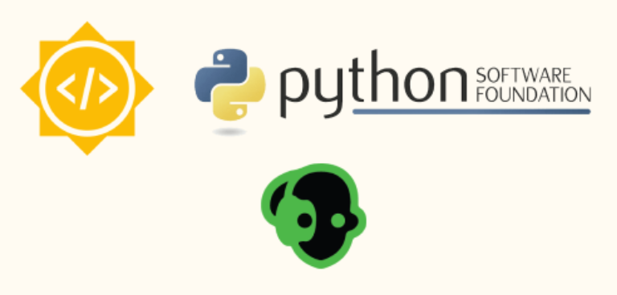

# GSoC 2024 Final Report

## Project: Enhancements to Exclusions Tab,Code Refactor and Cleanup,MySQL/MariaDB database directory format support

Contributor: [Shivansh Singh](https://github.com/shivansh02)

Sub-Organization: Borg Collective

Proposal Link: [Borg Collective Proposal](https://summerofcode.withgoogle.com/media/user/514ad0065129/proposal/gAAAAABmyeVH_rdFptUPYVyj3MechTzavE9UDxX2ebKN0jbHrPJoB5DcCNLRxzq_PD_bW-Or8qhcc3TbXOJalRouRrq-D2y3eFTfjCz60fo_TkDckDSBmE0=.pdf)

Organization: [Python Software Foundation](https://python-gsoc.org/)

Project Link: [Enhancements to Exclusions Tab,Code Refactor and Cleanup,MySQL/MariaDB database directory format support](https://summerofcode.withgoogle.com/programs/2024/projects/YjsXGlhT)

Mentors: [Manuel Riel (m3nu)](https://github.com/m3nu), [Dan Helfman (witten)](https://github.com/witten)

### Project Goals

[Borg](https://github.com/borgbackup/borg)  is a powerful file backup tool that performs tasks like compression, encryption, authentication, and data deduplication. It is a command-line tool, and is used by many users and organizations to back up their data.

[Vorta](https://github.com/borgbase/vorta)  is a desktop GUI for Borg that makes it easier to interact with it without knowing any CLI commands or other intricacies. It is a cross-platform application that is built using Python and Qt, and is used by beginners and advanced users alike.

[Borgmatic](https://github.com/borgmatic-collective/borgmatic)  is a CLI wrapper around Borg that stores all Borg settings and preferences inside a configuration file and makes it easy to automate backups. It also extends Borg's capabilities by adding support for running pre and post-backup hooks, setting up monitoring, backing up databases, and more.

The primary goal of this GSoC project was to improve the code quality, user experience, and functionality of the Vorta and Borgmatic applications. The project focused on three main areas:

1.  **Vorta Code Refactor, Cleanup, and Maintenance**: Addressing technical debt, improving code cohesion, and enhancing the maintainability of the codebase.
2.  **Vorta Exclusions Tab Enhancements**: Reinstating the Exclude-if-present feature  and expanding and improving the exclusion patterns.
3.  **Borgmatic MySQL/MariaDB Directory Format Support**: Implementing support for dumping MySQL/MariaDB databases in directory format.

### Project Achievements

#### Vorta: Code Refactor, Cleanup, and Maintenance Tasks

-   **Integration of Code Smell Detection Tools**: Scanned the repository using tools like CodeClimate to identify and resolve code smells, improving code quality.
-   **Modularization of `get_mount_points` Method**: Decomposed complex methods into smaller, more manageable methods, enhancing readability and maintainability.
-   **Switched to snake_case for .ui files**: Standardized the naming convention of `.ui` files by converting them to snake_case for consistency across the codebase.
-   **Changed source table design to match other tables in Vorta**: Updated the source table design to ensure uniformity with other tables in the Vorta application.
-   **Refactored big schedule_tab .ui and .py files into 4 smaller components**: Split the large `schedule_tab` UI and Python files into four modular components for better maintainability.
-   **Refactored archive_tab into 2 components**: Raised a PR to refactor the `archive_tab` into two separate components; the main functionality is complete, but tests are still pending.

#### Vorta: Exclusions Tab Enhancements

-   **Reinstated Exclude-if-Present Feature**: Brought back the Exclude-if-present feature, which was frequently requested by the community. Refactored the code to avoid duplication.
-   **Expanded Exclusion Patterns**: Added a wide range of system exclusion patterns to improve backup customization.
- **Implemented Alphabetical Sorting**: Ensured exclusion patterns are sorted alphabetically for easier navigation.

#### Borgmatic: MySQL/MariaDB Directory Format Support
The directory format for MySQL/MariaDB backups involves dumping the database into a directory structure rather than a single SQL file. This format provides a more granular approach, where each table is stored as a separate file, making it easier to manage, navigate, and selectively restore specific database objects.
I added support for the `directory` value in the format configuration option, modified the `mysqldump` command to support directory format dumps, and updated the restore function to handle the directory format. Once the PR gets merged, I will replicate the same changes for MariaDB, which should be very similar to MySQL Hook.

### Current State

-   **Vorta**: All proposed tasks except PR #2049 have been successfully completed and merged upstream. The codebase is now more maintainable, and the user experience has been enhanced.
-   **Borgmatic**: The project is 80% complete. A PR has been raised, and I am currently discussing the final changes with my mentor.

### What's Left to Do
- **Vorta**: Fix tests of PR #2049 and get it merged.
- **Borgmatic**: Finalize the remaining changes based on mentor feedback and get the PR merged.

## Pull Requests
A list of all the pull requests I made before and during GSoC, in chronological order of their creation.

### [Vorta](https://github.com/borgbase/vorta)

- [Fix:about dialogue grammar and yr ](https://github.com/borgbase/vorta/pull/1936)
- [Fix:loglink moved below logs table ](https://github.com/borgbase/vorta/pull/1939)
- [run borg compact after each prune](https://github.com/borgbase/vorta/pull/1959)
- [Reopen addrepowindow prefilled when adding repo fails ](https://github.com/borgbase/vorta/pull/1966)
- [VSC and android exclusion patterns](https://github.com/borgbase/vorta/pull/1967)
- [Improved Exception Dialog with Copy Paste ](https://github.com/borgbase/vorta/pull/1977)
- [Compaction Scheduling](https://github.com/borgbase/vorta/pull/1981)
- [hide password field if encryption is none ](https://github.com/borgbase/vorta/pull/2011)
- [Exclude If Present ](https://github.com/borgbase/vorta/pull/2016)
- [Remove duplicate sources on profile import ](https://github.com/borgbase/vorta/pull/2017)
- [Add misc exclusion patterns ](https://github.com/borgbase/vorta/pull/2021)
- [Update Log path in Issue Template](https://github.com/borgbase/vorta/pull/2032)
- [Sources table UI updated to match Archives table  ](https://github.com/borgbase/vorta/pull/2034)
- [Schedule tab refactoring](https://github.com/borgbase/vorta/pull/2035)
- [.ui files changed to snake_case](https://github.com/borgbase/vorta/pull/2042)
- [Refactor get_mount_points](https://github.com/borgbase/vorta/pull/2044)
- [Split archive tab](https://github.com/borgbase/vorta/pull/2049)
- [palette_changed connection moved to schedule_tab](https://github.com/borgbase/vorta/pull/2050)

### [Borgmatic](https://github.com/borgbase/vorta)

- [Custom dump command for mysql ](https://github.com/borgbase/vorta/pull/81)
- [support for NO_COLOR env var ](https://github.com/borgbase/vorta/pull/82)
- [WIP:MySQL Directory Format](https://github.com/borgbase/vorta/pull/84)

### Acknowledgements
I would like to express my sincere gratitude to my mentors for their invaluable support throughout this project. Special thanks to @m3nu for guiding me through the Vorta projects, and to @witten for their expert mentorship on the Borgmatic MySQL/MariaDB directory format support. Your insights and feedback were crucial to the success of these projects.
My thanks extend to the Python Software Foundation and the Borg Collective for this opportunity. The welcoming and supportive nature of the Borg community was much appreciated. I also want to acknowledge Google for organizing GSoC and providing a platform to work on meaningful projects.
